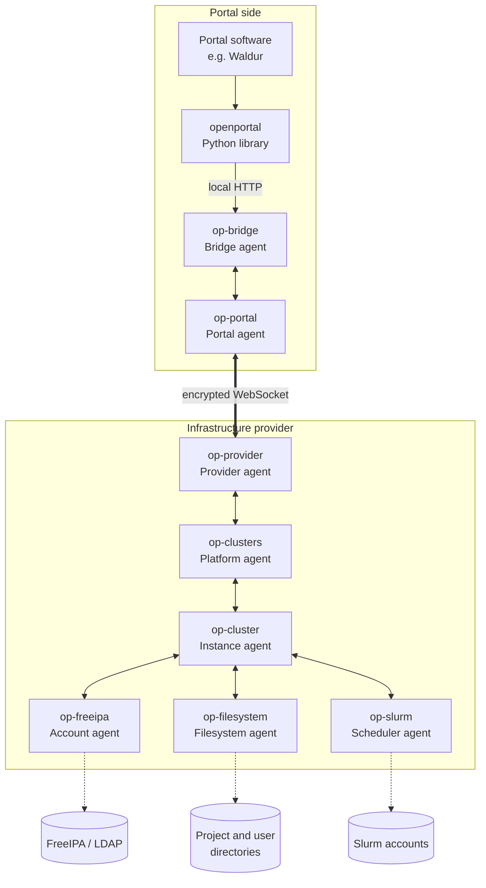
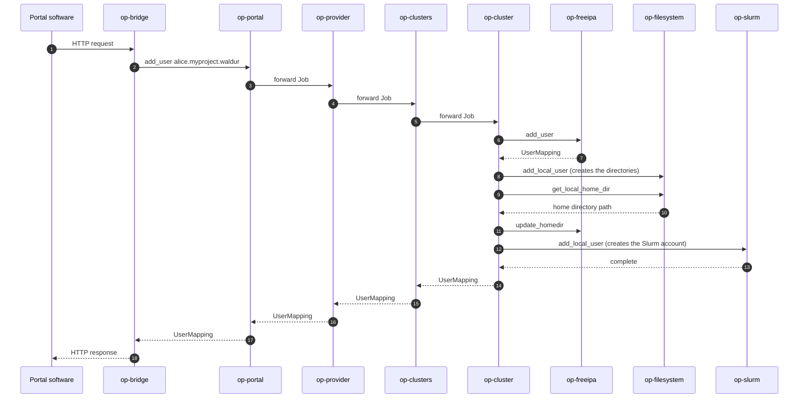
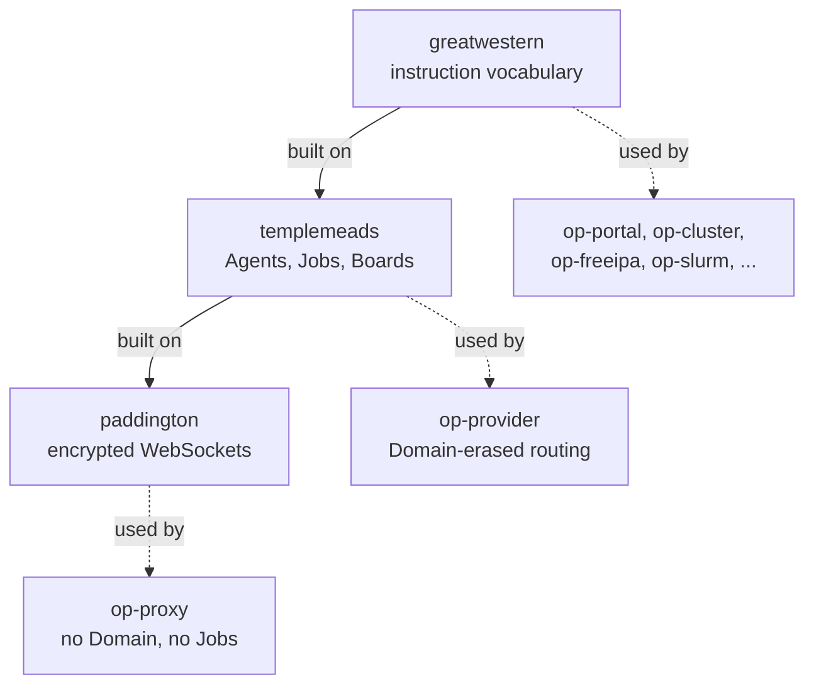

<!--
SPDX-FileCopyrightText: © 2024 Christopher Woods <Christopher.Woods@bristol.ac.uk>
SPDX-License-Identifier: CC0-1.0
-->

# OpenPortal

OpenPortal is a distributed infrastructure management protocol that provides
secure, authenticated communication between user portals (e.g. Waldur) and
digital research infrastructure (e.g. supercomputers). Rather than requiring
a single service with "god keys" that grant full access to the infrastructure,
OpenPortal uses a peer-to-peer agent architecture where each agent handles only
the specific operations it is permitted to perform.

Each agent is a small, statically compiled Rust executable. Agents communicate
over encrypted WebSocket connections and exchange structured Jobs. A typical
deployment has agents running at both the portal side and the infrastructure
side, coordinating to carry out tasks such as account creation, project
management, filesystem provisioning, and usage reporting.

## How it works

### The agent network

A deployment is a network of small agents, each one responsible for a single
slice of the business logic. Requests travel down the hierarchy as Jobs, and
results travel back up the same path. Every link is a separate encrypted
WebSocket connection secured by its own independent pair of symmetric keys, so
an agent can only ever talk to its direct neighbours — there is no key anywhere
in the network that grants access to everything.



Each agent holds only the credentials its own role needs: `op-freeipa` has
FreeIPA credentials but cannot touch the filesystem, `op-filesystem` has root
on the filesystem but knows nothing about Slurm, and the portal has neither.
Compromising one agent does not yield the keys of any other.

One further agent sits outside this hierarchy. `op-proxy` is a blind relay for
two agents that can each only make outbound connections, so neither can open a
port the other can reach — it forwards traffic it cannot decrypt, and is not a
trusted intermediary.

### How a request flows

Jobs are addressed with a dot-delimited destination path such as
`portal.provider.clusters.cluster`, and each agent forwards a Job one hop
along that path. Agents that perform real work decompose the Job into further
Jobs for their own neighbours. Adding a user to a cluster looks like this:



Every Job lives on a distributed Job Board and moves through the states
`created`, `pending`, `running`, and then `complete` or `error`. Boards are
synchronised whenever a connection is re-established, so a Job that was
in flight when an agent restarted is reconciled rather than lost.

### The three crates

Agents are built from three layers, and each agent depends only on the layers
its role actually needs.



`paddington` provides the transport: authenticated, encrypted, peer-to-peer
WebSocket connections. `templemeads` builds Agents, Jobs, Job Boards and
Notifications on top of it, but deliberately has no opinion about what a Job
asks for — it is generic over a `Domain` trait that supplies the vocabulary.
`greatwestern` is the reference Domain (`add_user`, `get_usage_report`,
`set_project_quota`, and so on), used by the portal, platform, instance and
leaf agents.

The two exceptions are deliberate. `op-provider` only routes Jobs, so it uses
`templemeads` with the domain-erased `Erased` marker and never depends on
`greatwestern` at all — which is what lets one provider sit between leaf agents
speaking different Domains. `op-proxy` sits lower still: it depends only on
`paddington`, has no Domain, and never handles Jobs or decrypts what it
forwards.

Targeting a different kind of infrastructure means writing a Domain in place of
`greatwestern` and reusing `paddington` and `templemeads` unchanged. See
[Writing your own Domain](docs/specifications/writing-a-domain.md).

For a full description of the design, the agent types, and worked examples, see
the [docs](docs) directory. For formal protocol and API specifications, see
[docs/specifications](docs/specifications).

## Agent types

| Binary | Role |
|---|---|
| `op-portal` | Entry point for portal software |
| `op-provider` | Represents an infrastructure provider |
| `op-clusters` | Platform agent for clusters |
| `op-cluster` | Instance agent for a single cluster |
| `op-freeipa` | Account management via FreeIPA |
| `op-filesystem` | Filesystem and quota management |
| `op-slurm` | Slurm account management |
| `op-bridge` | HTTP bridge for Python portal software |

## Compiling OpenPortal

OpenPortal is written in Rust, so you will need to have Rust installed.

To compile OpenPortal, run:

```bash
make
```

or

```bash
make release
```

or use the `cargo` command directly:

```bash
cargo build
```

or

```bash
cargo build --release
```

## Installing OpenPortal

The result of compilation will be a number of executable binaries in the
`target/debug` or `target/release` directories. These are static executables
that can be safely copied to their target destinations and run there.

To understand where to install the executables, you will first need to
understand what OpenPortal is, and how it is used. Please see the
[docs](docs) directory for detailed documentation on the
design and implementation of OpenPortal, together with worked examples.
Formal protocol and API specifications are in
[docs/specifications](docs/specifications).
