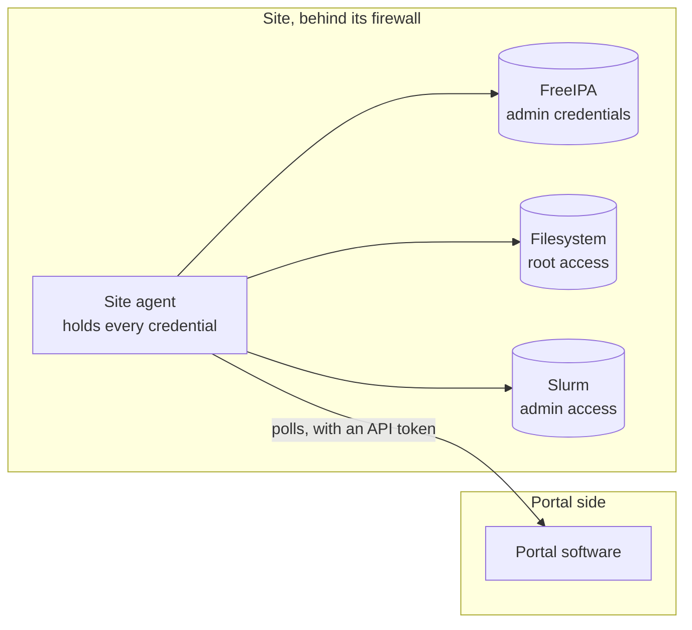

<!--
SPDX-FileCopyrightText: © 2026 Christopher Woods <Christopher.Woods@bristol.ac.uk>
SPDX-License-Identifier: CC0-1.0
-->

# 1. Why OpenPortal

## The job to be done

A user portal such as Waldur is where decisions about access are made: a
project lead adds a colleague to their project, an allocation panel awards a
project time on a machine. The infrastructure is where those decisions take
effect. Adding one user to one project on one cluster can mean creating an
account in FreeIPA, creating a home directory and a project directory with the
right owners and quotas, and adding a Slurm account with the right limits.

> *"Add alice to the demo project."*
> *"OK..."* - and then FreeIPA, the filesystem and Slurm all have to change.

The portal holds the decision. The site holds the privileged systems. Something
has to carry the decision across and do the privileged work, and the question
that matters is **where the keys live** while it does.

## The usual answer

The common pattern is a single site agent: one process that asks the portal for
what has changed, and then makes the changes itself.

It works, and it is how OpenPortal's own first deployment looked. But it has
three properties that get worse as a site grows:

- **Many keys in one place.** One process can read and change everything it
  touches. Compromise it and you have all of it.
- **Two jobs in one process.** Communicating the portal's intent and doing the
  privileged work happen together, so the code that parses messages from the
  outside world runs with the site's most powerful credentials.
- **One agent grows with the site.** Every new system, cluster or site means
  changing the one agent.

## The idea

> **Treat it as a communications problem.** Separate *communicating* the
> intent from the *privileged work* of carrying it out, and give each piece of
> that work to its own small agent.

OpenPortal is a protocol plus a secure network. The business logic still
exists, but it is split across many small agents, each of which holds at most
one privileged credential and can only talk to the neighbours it has been
introduced to. There is no single process - and no single key - that can do
everything.

[The agent network](02-the-agent-network.md) shows what that looks like in
practice.
