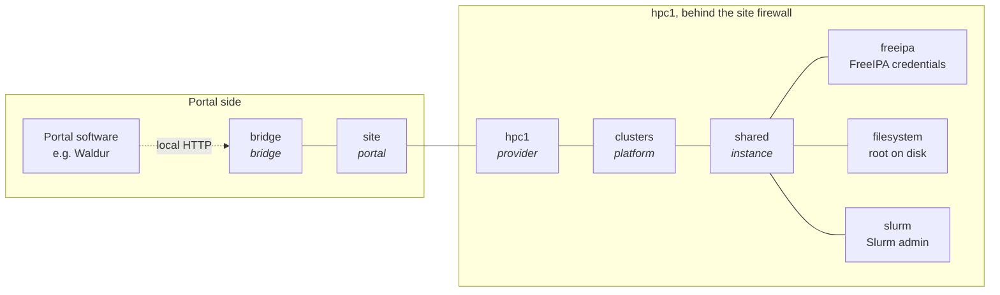
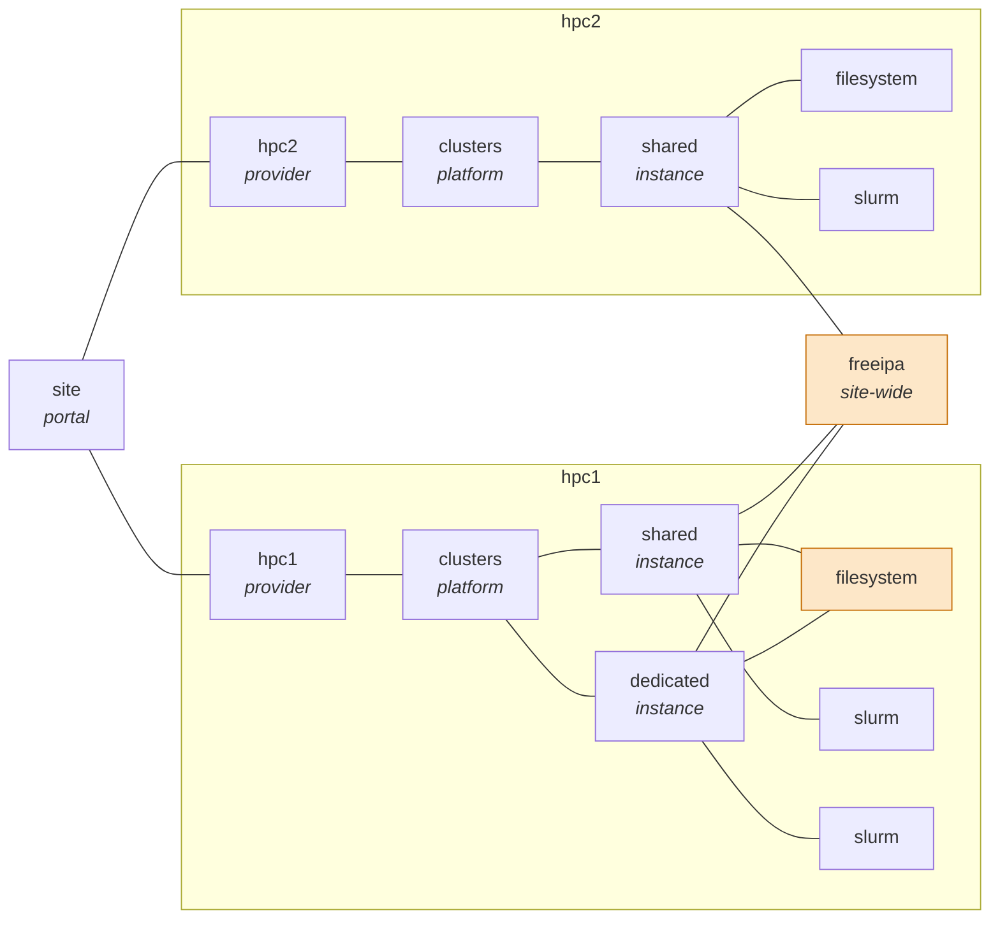

<!--
SPDX-FileCopyrightText: © 2026 Christopher Woods <Christopher.Woods@bristol.ac.uk>
SPDX-License-Identifier: CC0-1.0
-->

# 2. The agent network

## The split

Here is the same task as on the [previous page](01-why-openportal.md) - add
alice to the demo project - split across OpenPortal agents.



The portal software talks to a local `bridge` agent through the `openportal`
Python module (or the Java client). The bridge talks to the site's portal agent,
`site`. Beyond that, `hpc1` is the provider, `clusters` the platform agent and
`shared` the agent for one cluster - and only the three agents at the end of the
chain hold a privileged credential.

The portal asks for alice to be added with a single line:

```
site.hpc1.clusters.shared add_user alice.demo.site
```

That is a *destination* - the path of agents the request travels along - and
then an *instruction*. [templemeads](05-templemeads.md) describes how the
request travels; [greatwestern](06-greatwestern.md) describes the instruction.

**Every link in that diagram is its own encrypted WebSocket with its own keys,
and no agent holds more than one privileged credential.**

## The agents manage the site's systems

`freeipa`, `filesystem` and `slurm` are OpenPortal agents, not the systems
themselves. `shared` never talks to FreeIPA, Slurm or the disk directly: it only
sends Jobs to these three agents over its encrypted links. Each of them is the
one place that holds the credential for its system.

| Agent | Talks to its system through | What it holds |
|---|---|---|
| `freeipa` | FreeIPA's JSON-RPC API over HTTPS | FreeIPA admin credentials |
| `filesystem` | Runs on a host with the storage mounted: `mkdir`, `chown`, quotas | Root on that host |
| `slurm` | `sacctmgr`, `sacct`, `scontrol`, or the `slurmrestd` REST API | Slurm admin rights |

[op-freeipa](agents/op-freeipa.md) and [op-slurm](agents/op-slurm.md) describe
the two most privileged of these in depth.

## Design principles

Four principles, unchanged since the first design. Everything else in this guide
is about how they are enforced.

- **One agent, one responsibility.** `freeipa` only talks to FreeIPA.
  `filesystem` only creates and removes directories. `slurm` only manages Slurm
  accounts.
- **At most one privileged key per agent.** The portal side holds no
  infrastructure credentials at all. There is no key anywhere that grants access
  to everything.
- **Neighbours only.** An agent can only talk to peers it has been introduced to
  out-of-band, each over its own encrypted link.
- **Compromise stays contained.** Taking over one agent yields that agent's
  credential and its links - not the keys of any other relationship.

## The agents

Each is a separate static binary with its own config file.

| Binary | Role | Responsible for |
|---|---|---|
| `op-bridge` | bridge | A local, signed HTTP API for portal software (Python, Java) |
| `op-portal` | portal | One portal's entry point to the network; checks ownership |
| `op-provider` | provider | Routes Jobs for one infrastructure provider |
| `op-clusters` | platform | The set of clusters a provider offers |
| `op-cluster` | instance | One cluster: decomposes Jobs into work for its leaf agents |
| `op-freeipa` | account | FreeIPA: users, groups, blocking |
| `op-filesystem` | filesystem | Directories and quotas, as root |
| `op-slurm` | scheduler | Slurm accounts, limits and usage |
| `op-proxy` | relay | A blind relay for two agents that can each only dial out |

`op-localaccount` also exists, as an account agent for test environments that
manages local Unix accounts rather than FreeIPA.

## Scaling out

A second supercomputer, `hpc2`, is a second provider with its own platform,
instance and leaf agents. The portal addresses one or the other by changing one
element of the destination:

```
site.hpc1.clusters.shared add_user alice.demo.site
site.hpc2.clusters.shared add_user alice.demo.site
```

## Sharing is wiring, not code

Which agents are shared and which are separate is expressed entirely by **who is
introduced to whom**. Here `hpc1` runs two clusters, `shared` and `dedicated`,
which share one `filesystem` agent but each have their own `slurm`. `hpc2` has
its own of both. A single site-wide `freeipa` agent is introduced to every
instance, so a user's account is the same everywhere.



*The highlighted agents are shared: one agent, introduced to several instances.*

Changing what is shared - giving `dedicated` its own filesystem, or a cluster
its own directory service - is a matter of who is introduced to whom. No code
changes.

## The instance decides what a command means

The portal asks for the same thing whatever the destination, and the instance
agent that receives it decides what that takes. `site.hpc1.clusters.shared
add_user alice.demo.site` creates alice's FreeIPA account, her directories and
her Slurm association, because that is what joining a cluster means there.

That is a property of the design rather than of `op-cluster`, and it is what
lets one generic vocabulary cover very different services. A storage service,
say, would be another provider whose instance agent answers the same
instruction differently:

```
site.data.storage.projects add_user alice.demo.site
```

Its instance agent would make sure alice exists in the site-wide `freeipa`, and
add her to the `demo` project's storage volume through its own `filesystem`
agent, with no Slurm involved at all. The portal needs to know nothing more than
the new destination.

> **What exists today.** `op-cluster` is currently the only instance agent, and
> it expects an account, a filesystem and a scheduler agent all to be connected:
> it refuses `add_user` and `add_project` without them. A storage instance like
> the one above would be a new instance agent - the design accommodates it, but
> this repository does not yet ship one.

## The same pattern stretches

The hierarchy generalises in every direction:

- **More instances.** A separate cluster is another instance agent beside
  `shared`, for example `site.hpc1.clusters.dedicated`.
- **More platforms.** A different kind of service, such as notebooks, would be a
  new platform agent under the provider. Not yet built.
- **More portals.** One portal can award resources on another, with no shared
  database or credentials - see [Portal to portal](03-portal-to-portal.md).
- **More infrastructure.** New leaf agents connect OpenPortal to other systems,
  and each holds only its own credential.

## What this means for portal software

Because everything site-specific stays with the site's agents, the portal needs
to know very little.

| The portal needs to know | The site's agents decide |
|---|---|
| **Destinations** - `site.hpc1.clusters.shared` | Which systems are involved, and in what order |
| **A small, generic set of instructions** - `add_user`, `remove_user`, `add_project`, `get_usage_report` | Local usernames, groups and directories |
| **Its own identifiers** - `alice.demo.site` | Accounts, quotas, limits and storage volumes, and how usage is measured |

A new kind of resource at a site is a new destination, not new portal code.

---

[← 1. Why OpenPortal](01-why-openportal.md) · [Contents](README.md) · [3. Portal to portal →](03-portal-to-portal.md)
