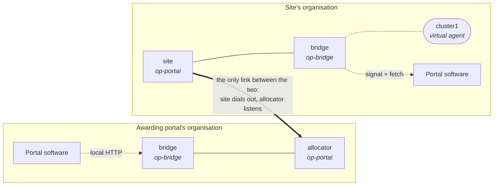
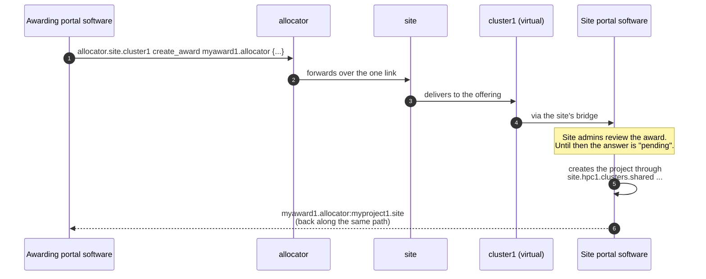

<!--
SPDX-FileCopyrightText: © 2026 Christopher Woods <Christopher.Woods@bristol.ac.uk>
SPDX-License-Identifier: CC0-1.0
-->

# 3. Portal to portal

So far the portal and the infrastructure have belonged to the same organisation.
OpenPortal also lets one *portal* send requests to another - which is how a
national allocation portal can award time on a site's machine without sharing a
database, an account or a credential with that site.

Two roles, two organisations:

- the **awarding portal** decides who gets what - here, `allocator`;
- the **site portal** runs the resources and decides how an award becomes a
  project on them - here, `site`.

## The shape



Each organisation runs its own portal software, bridge and portal agent. The one
link between `allocator` and `site` is the only connection between the two
organisations, peered with an invite like any other link.

`site` advertises the resources it is willing to take awards on as
**offerings**. Each offering appears as a *virtual agent* - here `cluster1` -
which `allocator` addresses directly:

```
allocator.site.cluster1 create_award myaward1.allocator {...}
```

The awarding portal needs one destination per resource, and nothing more. It
never sees `hpc1`, FreeIPA or Slurm: what happens beyond `site` is entirely the
site's business.

### Which side listens

The awarding portal listens and the site dials out to it. An awarding portal
serves many sites, so it is the one party every site has to reach; making it the
server means only it needs a port open to the internet, and every site can keep
its whole OpenPortal deployment behind its own firewall. Once connected, the
link is fully bidirectional, so `allocator` still sends its requests down the
connection `site` opened. [paddington](04-paddington.md#which-side-listens)
explains why direction only matters for who opens the connection.

## Sending an award



1. The awarding portal's software sends a single `create_award` addressed to
   the site's `cluster1` offering.
2. `allocator` forwards it over the one link to `site`.
3. `site` hands it to the `cluster1` virtual agent, and the site's bridge passes
   it to the site's portal software.
4. The site's administrators approve it - the award stays pending until then -
   and approval creates the project through the site's own agents, exactly as in
   [the agent network](02-the-agent-network.md).
5. The answer is a *project mapping*: the awarding portal's name for the award,
   paired with the site's name for the project it created. That pairing is the
   key everything else - usage reports in particular - is joined on.

The site authorises the request against `forwarded_for`, which records the
original destination (`allocator.site.cluster1`) and is set by the site's own
portal agent, not by the caller. [The site portal API](../specifications/site-portal-api.md)
describes what a site portal must answer, and how.

## Virtual agents

An offering is a **virtual agent**: a name standing for one resource the site
runs, registered on the fly by the site's portal software. It has no process, no
invite and no keys of its own.

- The site's portal software registers its offerings through its bridge with
  `sync_offerings`, which creates and deletes virtual agents to match the list
  it is given. `add_offerings` and `remove_offerings` make incremental changes.
- Jobs addressed to a virtual agent are handed to the site's portal software
  through the bridge.
- To the rest of the network it behaves like a real agent: it can be addressed
  and routed to, and it is covered by the same portal-route checks.
- A request for a resource that is not offered yet is **held, not refused**, and
  delivered once the offering exists. If an award goes quiet, check the
  offerings first.

The site writes its offering as `cluster1.site.allocator` - resource, this
portal, awarding portal - and the awarding portal addresses it as
`allocator.site.cluster1`. The two spellings are reversed, which catches
everybody once.

[Connecting to an awarding portal](08-connecting-to-an-awarding-portal.md) walks
through setting all of this up, and the
[site portal example](../../python/examples/site_portal) runs it on your laptop.

---

[← 2. The agent network](02-the-agent-network.md) · [Contents](README.md) · [4. paddington →](04-paddington.md)
