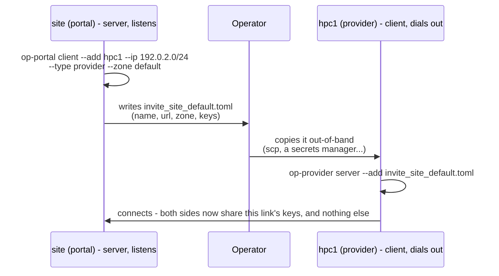
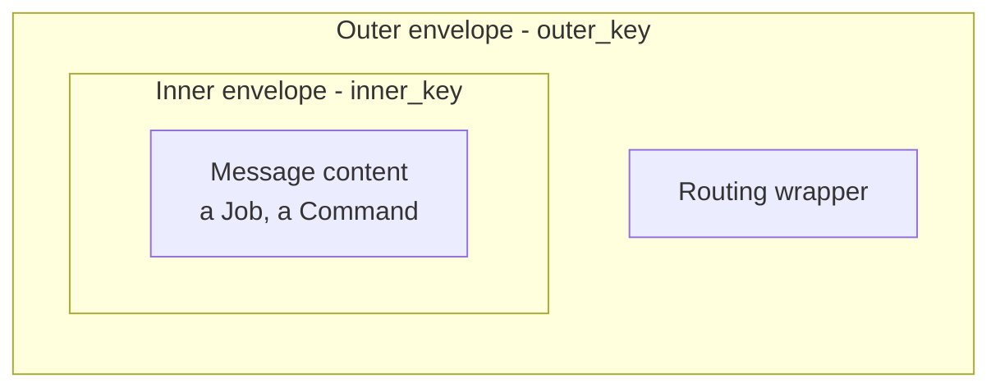
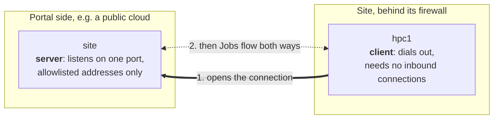
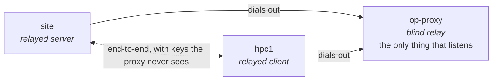
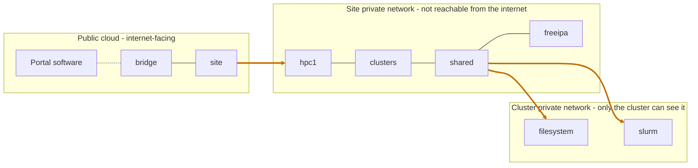

<!--
SPDX-FileCopyrightText: © 2026 Christopher Woods <Christopher.Woods@bristol.ac.uk>
SPDX-License-Identifier: CC0-1.0
-->

# 4. paddington: who can talk to whom

OpenPortal is three layers, each a Rust crate that depends only on the one
below:

| Layer | Crate | Answers | Used on its own by |
|---|---|---|---|
| 3 | [greatwestern](06-greatwestern.md) | What agents say | - |
| 2 | [templemeads](05-templemeads.md) | How work moves | `op-provider`, which only routes |
| 1 | **paddington** | Who can talk to whom | `op-proxy`, which only relays |

Most agents use all three, and an agent such as `op-portal` is one static
executable: these crates plus one slice of business logic. The names are
stations: Paddington to Temple Meads, on the Great Western.

paddington is the transport, and it is where the security lives: introductions,
authentication, encryption and the shape of the network.

## Introducing agents

Two agents can only talk if an operator has introduced them, and an introduction
always has one **server** end and one **client** end. The server issues an
invitation; the client accepts it.

1. `site` creates an invitation for `hpc1`, naming the address range it will
   connect from, the type it must present as, and the zone the link belongs to.
2. The invitation carries freshly generated keys for this one link, so it is
   copied out-of-band - never over the network it is about to secure.
3. `hpc1` accepts it. Both sides now share this link's key pair, and nothing
   else.

No key material ever crosses the network in the clear, and there is no in-band
way for agents to change keys themselves. Rotation is out-of-band too:
`client --rotate` issues a new invitation, which the other side applies with
`server --rotate`. [Agent configuration](../specifications/agent-configuration.md)
has every flag.

## Four checks before a single message

When a client connects, the server applies four independent checks. **All four
must pass** before a single message is processed.

| | Check | The question |
|---|---|---|
| 1 | IP allowlist | Is it coming from an address or range I expect for this peer? (IPv4 and IPv6) |
| 2 | Handshake | Does its opening message decrypt with the keys I share with that peer? |
| 3 | Zone | Do we agree which zone this link belongs to? |
| 4 | Name | Is it the agent I was introduced to? |

Spoofing an address gets you nothing without the keys. Stealing one link's keys
gets you nothing unless you also connect from the right place, in the right zone,
as the right name.

### One peer, one active connection

A link is served to exactly one connection at a time. A second connection under
an identity that is already connected is not served alongside the first: it is
held as a *standby*, and promoted automatically if the active one fails. That is
how client-side [high availability](../specifications/highavailability.md)
works - run several replicas of an agent, and one is active while the rest wait.

This is not a security control. A standby has passed all four checks, so it holds
the same keys and is trusted exactly as fully as the active connection - it even
receives job-board updates while it waits, so that it can take over cleanly. What
it does give you is a link whose other end is always one peer, rather than an
API that serves however many clients present a valid credential.

## On the wire

Each link has two independent pre-shared keys, and each message travels inside
two envelopes:

- **Session keys.** Each connection uses fresh, random session keys, sent sealed
  under the link's pre-shared keys. So the pre-shared keys only ever encrypt
  high-entropy random data, which leaves nothing to attack them with.
- **Per-message keys.** Every message gets its own sub-key, derived with
  HKDF-SHA512, and is encrypted with XChaCha20-Poly1305.
- **Replay protection.** Messages carry per-sender nonces, checked against an
  anti-replay window.
- **Two keys, two envelopes.** An observer holding one key still cannot read both
  the routing and the content.
- **Transport.** One full-duplex WebSocket per link: real-time push in both
  directions.

**A deliberate trade-off: there is no forward secrecy.** Session keys are
*transported*, sealed under the pre-shared keys, rather than agreed in-band.
Adding a Diffie-Hellman exchange would reintroduce in-band key agreement, which
the design deliberately excludes. Anyone who records a connection and later
obtains that link's pre-shared keys can decrypt it - so rotate keys to bound the
exposure. [The security model](../specifications/security-model.md) sets this
out in full.

## The shape of the network

- **Neighbours only.** Every link has its own key pair, and an agent cannot
  address anyone it was not introduced to.
- **Zones.** Every link is tagged with a zone both ends must agree on, which
  keeps separate trust domains apart even over the same agents.
- **Portal routes.** Each agent learns the one path by which a portal reaches it,
  and refuses commands for that portal arriving from anywhere else.
- **No central key store.** A link's keys live only in the config files of its
  two peers - which can themselves be encrypted at rest. There is nowhere to
  steal them all from.

Secrets are held in types that zero their memory when dropped, and `unsafe` code
is forbidden across the workspace. OpenPortal has had two code-level security
reviews, with every finding fixed or documented:
[the first](../specifications/security-review.md) and
[the second](../specifications/security-review-2.md).

## Which side listens

Every link has exactly one server end and one client end, fixed when the peers
are introduced: the server runs `client --add` and issues the invitation, and the
client accepts it with `server --add`. **So you choose which side is the one you
are willing to expose.**

- **The server must be reachable.** It opens one listening port, and admits only
  the clients it has invited, from their expected addresses.
- **The client reaches out.** It only makes outbound connections, and reconnects
  by itself if the link drops.
- **Then the roles don't matter.** Once connected, the WebSocket is full duplex:
  either side can send Jobs and results.

Direction only decides who opens the connection. Choose it so that the side
behind the stricter firewall dials out - which is why a site dials out to the
portal in front of it, and why a site dials out to an
[awarding portal](03-portal-to-portal.md#which-side-listens).

## When neither side can listen

Some sites will not have anything reachable at all. `op-proxy` is a blind relay
for that case: both agents dial out to it, and it forwards traffic between them.

- **Both sides dial out.** Neither opens a port; each is introduced to the proxy
  as an ordinary client.
- **It only sees ciphertext.** `site` and `hpc1` still exchange their own key
  pair by invitation (`client --add --proxy` on one side) and authenticate each
  other directly through the relay. The proxy forwards traffic it cannot decrypt,
  and is not a trusted intermediary.
- **Default deny.** It relays only the pairs an operator has allowed:
  `op-proxy allow site hpc1`.

`op-proxy` depends on paddington alone: it has no Domain and never sees a Job.
Running several replicas of a relayed server behind one proxy also gives
server-side high availability. See
[the relay design](../plans/archive/blind-relay-proxy-design.md).

## Spanning several networks

Because each agent only has to reach its direct neighbour, one agent network can
span networks that cannot see each other at all.

The thick links are the only connections that cross a network boundary, and each
is a single, allowlisted, encrypted WebSocket. There are no VPNs, tunnels or
routes between the networks - and a command sent from the internet still reaches
`slurm` on the cluster without a hole through any boundary.

---

[← 3. Portal to portal](03-portal-to-portal.md) · [Contents](README.md) · [5. templemeads →](05-templemeads.md)
