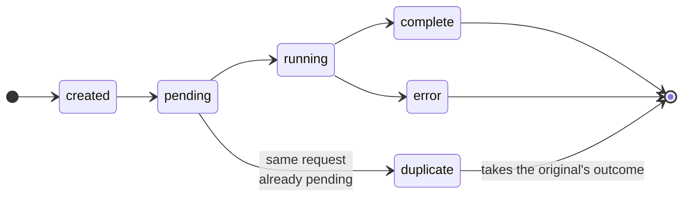
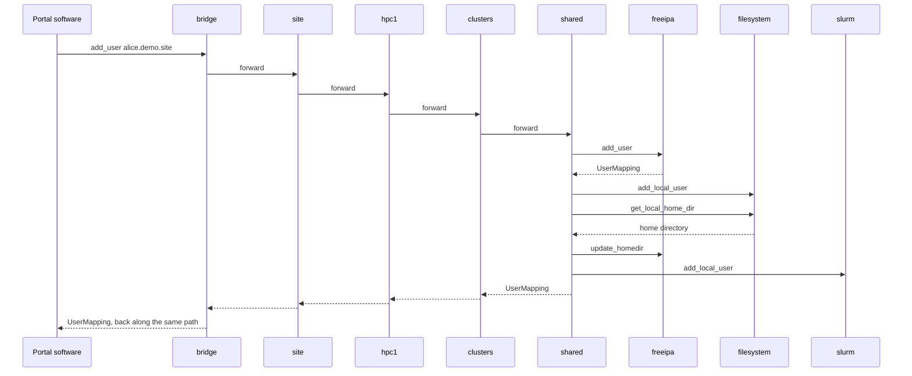
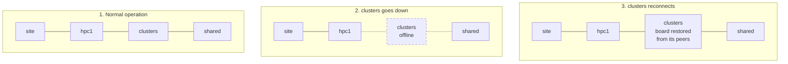
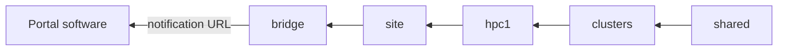

<!--
SPDX-FileCopyrightText: © 2026 Christopher Woods <Christopher.Woods@bristol.ac.uk>
SPDX-License-Identifier: CC0-1.0
-->

# 5. templemeads: how work moves

templemeads is the second layer: Agents, Jobs, Job Boards and Notifications,
routed hop by hop along a destination. It is also where OpenPortal's resilience
comes from.

It deliberately has **no opinion about what a Job asks for**. templemeads is
generic over a *Domain*, which supplies the vocabulary of instructions;
[greatwestern](06-greatwestern.md) is the one every built-in agent uses. That is
what lets `op-provider` route Jobs without ever parsing them - it uses
templemeads with a domain-erased marker - and so sit above agents that speak
different Domains.

## Jobs

```
site.hpc1.clusters.shared add_user alice.demo.site
└───────────┬───────────┘ └───────────┬──────────┘
       destination                instruction
```

- The **destination** is a dot-delimited path of agents, followed one hop at a
  time. templemeads owns it.
- The **instruction** is supplied by the Domain. templemeads treats it as opaque.

Every Job also carries an id, a version, an expiry time - two minutes by
default, so nothing waits forever - and, once it finishes, a typed result. It
moves through these states:



## Routing

The portal software submits a Job through its bridge, and each agent forwards it
one hop along the destination. Only the agent at the end of the path - the
instance - knows how to turn `add_user` into work, and it does so by sending
sub-jobs of its own to its neighbours:



`shared` creates the account in FreeIPA, which decides the local Unix name and
returns it as a mapping; creates the directories; looks up the home directory and
records it in FreeIPA; then creates the Slurm association. Everyone else just
forwards. **Leaf agents never see portal-level commands** - only the
`*_local_*` forms, which carry mappings ([greatwestern](06-greatwestern.md#three-tiers-of-identifiers)
explains why).

## Self-healing

Every Job in flight sits on the Job Boards of every agent along its path, and
boards are held per peer, so both ends of each link know the Job and its state.



1. The `add_user` Job is in flight, and is on the board of every agent on its
   path.
2. `clusters` goes down. The links on either side drop, but `hpc1` and `shared`
   still hold the Job. Nothing is lost, and nobody needs to intervene.
3. `clusters` reconnects, and its board is restored from its peers. The Job
   carries on.

Boards re-synchronise on every reconnection, so state is only lost if the whole
chain goes down at once. Combined with idempotent instructions and portal
retries, a restart or failover is invisible to the portal.
[High availability](../specifications/highavailability.md) covers standby
replicas and failover in full.

## Duplicate detection

Portal software is expected to retry on an error or a timeout, and a board
re-synchronising after a reconnection can replay work too. Rather than run the
same thing twice, a board recognises a retry:

1. **The first request arrives.** Job A goes on the board and starts its work.
2. **A retry arrives while A is still pending** - the same final destination and
   the same instruction. It becomes Job B, recorded as a *duplicate* of A
   rather than run.
3. **A finishes**, and B takes A's final state and result. The work ran once,
   and whoever is polling B sees the right answer.

Up to 100 duplicates are merged into one original. If the original has gone
stale, or that limit is reached, the retry is refused with an error and should
simply be sent again.

## Notifications

Everything so far has been a **Job**: a request that travels to its destination
and must be answered. A **Notification** is news. It travels along the same
paths - often back *up* the chain - and nobody replies.



When `shared` has finished adding alice, for example, it sends a `user_added`
notification back along the reversed destination. Each agent passes it one hop
up the chain, and the bridge signals the portal software through its
notification URL. Portals can also send notifications down into the network
through their bridge.

| | Job | Notification |
|---|---|---|
| **Delivery** | Acknowledged, and tracked on Job Boards | Fire-and-forget, like UDP |
| **Result** | A typed result, or an error | None |
| **Survives restarts** | Yes: reconciled when boards re-synchronise | No |
| **Use it for** | Changing things, and asking questions | Telling peers that something happened |

greatwestern defines fifteen events: users, projects and awards that have been
added, removed or changed; users and projects that have been blocked or
unblocked; and awards that have been accepted or rejected. See
[the notification protocol](../specifications/notification-protocol.md).
