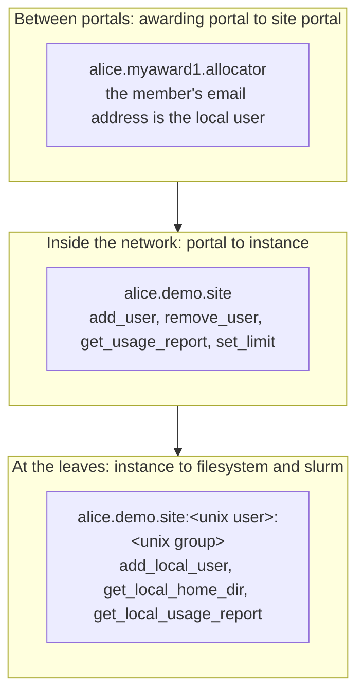

<!--
SPDX-FileCopyrightText: © 2026 Christopher Woods <Christopher.Woods@bristol.ac.uk>
SPDX-License-Identifier: CC0-1.0
-->

# 6. greatwestern: what agents say

greatwestern is the third layer: a grammar of instructions and identifiers for
HPC and portals. It is the *reference Domain* - every built-in agent is compiled
against it - but not a privileged part of the protocol. A different kind of
infrastructure could [supply its own Domain](../specifications/writing-a-domain.md)
and reuse paddington and templemeads unchanged. In practice the easiest place to
start is extending greatwestern, which also keeps everyone interoperable.

## The grammar

Every instruction is a single line of text:

```
<destination> <instruction> <arguments...>
```

with a canonical parse and a canonical string form. The one JSON argument,
`AwardDetails`, always comes last.

| Identifier | Example | Meaning |
|---|---|---|
| Portal | `site` | The portal that owns everything below it |
| Project | `demo.site` | A project within that portal |
| User | `alice.demo.site` | A user within that project |
| Project mapping | `demo.site:<group>` | A project, and the local group it maps to |
| User mapping | `alice.demo.site:<user>:<group>` | A user, and the local user and group they map to |

Two rules make the grammar safe to build on:

- **Ownership.** An instruction about a portal's users or projects is only
  accepted if it entered the network through that portal - its destination must
  start with that portal. One portal can never manage another portal's users.
- **Idempotency.** Every instruction is designed to be safely re-run. Running
  `add_user` twice leaves the same end state as running it once, which is what
  lets board re-synchronisation, retries and failover
  ([templemeads](05-templemeads.md)) safely repeat work.

## Instructions

A small, generic set covers what portals need. Some examples:

| Instruction | Does |
|---|---|
| `site.hpc1.clusters.shared add_user alice.demo.site` | Give alice an account on `shared` |
| `site.hpc1.clusters.shared block_user alice.demo.site` | Stop logins, but keep the account and files |
| `site.hpc1.clusters.shared is_user_added alice.demo.site` | Did an earlier `add_user` complete? |
| `site.hpc1.clusters.shared get_usage_report demo.site last_month` | The project's usage, per day |
| `site.hpc1.clusters.shared get_storage_report demo.site` | Storage used, and quotas |
| `allocator.site.cluster1 create_award myaward1.allocator {...}` | One portal awarding on another |

The families are projects and awards, users, state verification (`is_*`),
mappings, directories, local accounts, usage, storage, and compute limits. From
Python, any of them is `openportal.run("site.hpc1.clusters.shared add_user
alice.demo.site")`. [The instruction protocol](../specifications/instruction-protocol.md)
is the complete reference.

## Three tiers of identifiers

Names change meaning as a request moves through the network, and each tier only
ever sees the names it needs.



- **Between portals**, an awarding portal knows each member by email address,
  and that is what appears as the local user in a mapping:
  `alice.myaward1.allocator:alice@example.org:myaward1.allocator`. The awarding
  portal never needs to know a Unix username or group.
  ([Site portal API §4.2](../specifications/site-portal-api.md#42-members) has
  the exact form.)
- **Inside the network**, portals speak in OpenPortal identifiers such as
  `alice.demo.site`.
- **At the leaves**, the account agent decides the local Unix user and group,
  once, and returns them as a mapping. The instance then sends `add_local_user`
  *with that mapping* to `filesystem` and `slurm`. The `*_local_*` instructions
  only ever take mappings, so a leaf agent never has to work out a name for
  itself, and two agents can never disagree about one.

Accounting is recorded against local names and translated back on the way out,
which is why a usage report can be read in whichever namespace asked for it -
`report.remap_project()` in Python.

## Adding new instructions

Each agent handles only its own instructions, and refuses the rest:

```rust
// cluster/src/main.rs, simplified
match job.instruction() {
    AddUser(user) => { ... }
    RemoveUser(user) => { ... }
    BlockUser(user) => { ... }
    // ...only what an instance can do
    _ => Err(InvalidInstruction(...)),
}
```

- **Anything else is refused with an error, never guessed at.**
- **Routers don't need to understand.** `op-provider` forwards Jobs without
  parsing their instructions at all.
- **So the grammar can grow safely.** A new instruction only matters to the
  agents that act on it. Agents that never see it are unaffected, and an old
  agent that does see it fails closed.

One caveat: the agents on a path that *do* parse greatwestern - portal, platform
and instance - need a version that knows a new instruction before they can
forward it. Portal software follows the same rule from the other side: an
instruction it does not implement is answered as unsupported, not ignored.

---

[← 5. templemeads](05-templemeads.md) · [Contents](README.md) · [7. Running OpenPortal →](07-running-openportal.md)
